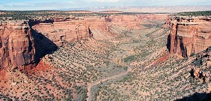

[Back to README](README.md)

#7-15-18 Great Sand Dunes

##Zapata Falls

This popular short hike is located on BLM (US Bureau of Land Management) land south of the national park, off of Highway 150. It is a good option for summer afternoons when sand surface temperatures are high. Simply driving to the trailhead provides an excellent view of the entire dunefield and San Luis Valley. However, the hike to the falls requires wading over slippery rocks into a rock crevasse.

#7-16-18 Curecanti

##The Morrow Point Boat Tour

Possibly the coolest experience of your trip, don't miss the Morrow Point Boat Tour. This 1 1/2 hour ride on a 42-passenger pontoon boat is a unique way to see the upper Black Canyon within Curecanti.

#7-17-18 Black Canyon

##Black Canyon of the Gunnison

Big enough to be overwhelming, still intimate enough to feel the pulse of time, Black Canyon of the Gunnison exposes you to some of the steepest cliffs, oldest rock, and craggiest spires in North America. With two million years to work, the Gunnison River, along with the forces of weathering, has sculpted this vertical wilderness of rock, water, and sky.

#7-18-18 Mesa Verde

##Spruce Tree House

Spruce Tree House, the third largest cliff dwelling (Cliff Palace and Long House are larger), was constructed between A.D. 1211 and 1278 by the ancestors of the Pueblo peoples of the Southwest. The dwelling contains about 130 rooms and 8 kivas (kee-vahs), or ceremonial chambers, built into a natural alcove measuring 216 feet (66 meters) at greatest width and 89 feet (27 meters) at its greatest depth. It is thought to have been home for about 60 to 80 people.

#7-19-18 Colorado National Monument

##Ute Canyon Trail

Downstream, the canyon is rather straight for about two miles and then it veers off to the right. Primitive and unmaintained.

#7-20-18 Rocky Mountain National Park

##Astronomy in the Park

Observe the night sky with the help of a park ranger and expert volunteer astronomers. Dress warmly, bring binoculars and a flashlight. Thirty minute program followed by viewing. Meet at Upper Beaver Meadows Trailhead.

###### Source: [National Park Service](http://nps.gov), 

[Back to README](README.md)
